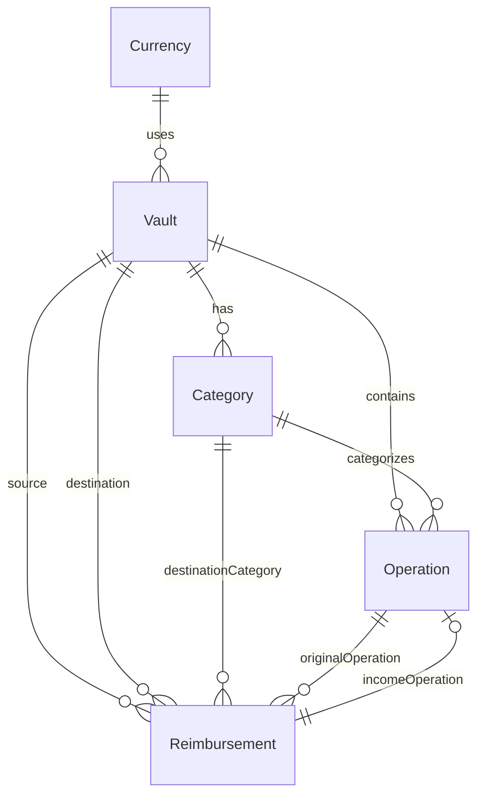

# 6. Domain Model

This page records shared model facts. Feature-specific meaning and decisions live in the feature pages.

## Source of Truth

- Core Data model: `Core/Data/Model/VaultModel.xcdatamodeld/VaultModel-v6.xcdatamodel/contents`
- Generated properties: `Core/Data/Model/*+CoreDataProperties.swift`
- DTOs: `Core/Domain/DTO/*`
- Repository helpers/enums: `Core/Data/Repository/Operation+CoreDataHelpers.swift`

## Entities

### Vault

Confirmed fields:

- `id: UUID`
- `title: String`
- `initialDeposit: Double`

Confirmed relationships:

- `categories`: to-many Category, cascade delete.
- `operations`: to-many Operation, cascade delete.
- `currencyRelation`: to-one Currency.
- `sourceReimbursements`: to-many Reimbursement, nullify delete.
- `destinationReimbursements`: to-many Reimbursement, nullify delete.

DTO:

- `id`
- `initialDeposit`
- `name`
- `currentBalance`
- `currency`

### Currency

Confirmed fields:

- `id: UUID`
- `code: String`
- `name: String`
- `symbol: String`

Confirmed relationship:

- `vaults`: to-many Vault.

Current product behavior: EUR is ensured and used during Vault creation.

### Category

Confirmed fields:

- `id: UUID`
- `name: String`
- `emoji: String?`
- `color: String?`
- `type: Int16` mapped to `OperationType`
- `visibleInPlot: Bool`
- `hasMonthlyBudget: Bool`
- `monthlyBudget: Decimal?`

Confirmed relationships:

- `vault`: to-one Vault, nullify delete.
- `operations`: to-many Operation, nullify delete.
- `reimbursements`: to-many Reimbursement, nullify delete.

DTO:

- `id`
- `title`
- `operationType`
- `visibleInPlot`
- `emoji`
- `color`
- `hasMonthlyBudget`
- `monthlyBudget`
- `hasOperations`

### Operation

Confirmed fields:

- `id: UUID`
- `amount: Double`
- `date: Date`
- `title: String?`
- `subtitle: String?`
- `type: Int16` mapped to `OperationType`

Confirmed relationships:

- `vault`: to-one Vault, nullify delete.
- `category`: to-one Category, nullify delete.
- `reimbursements`: to-many Reimbursement, nullify delete.
- `reimbursementSource`: to-one Reimbursement, nullify delete.

DTO:

- `id`
- `amount`
- `date`
- `title`
- `notes`
- `operationType`
- `category`
- `reimbursements`
- computed `totalReimbursed`
- computed `netAmount`

### Reimbursement

Confirmed fields:

- `id: UUID`
- `amount: Decimal`
- `notes: String?`
- `status: Int16` mapped to `ReimbursementStatus`

Confirmed relationships:

- `originalOperation`: to-one Operation.
- `incomeOperation`: to-one Operation.
- `sourceVault`: to-one Vault.
- `destinationVault`: to-one Vault.
- `destinationCategory`: to-one Category.

DTO:

- `id`
- `amount`
- `notes`
- `status`
- `sourceVault`
- `destinationVault`
- `destinationCategory`
- computed `isSameVault`

## Enums

```swift
OperationType.income = 0
OperationType.expense = 1

ReimbursementStatus.expected = 0
ReimbursementStatus.received = 1
ReimbursementStatus.cancelled = 2
```

## Relationship Diagram



## Model Risks

- Several model relationships are optional while DTOs force unwrap them.
- Category color is optional in Core Data but required by DTO/dashboard mapping.
- Operation title is optional in Core Data but force-unwrapped by `OperationDTO`.
- Category delete nullifies operations at Core Data level; app UI tries to avoid this, but domain delete does not enforce it.

## Decision Blocks

> **Decision Block: MODEL-001 - Optional Relationship Strategy**
>
> Status: Unknown
>
> Decide whether Vault, Category, Operation, and Reimbursement relationships should be non-optional by model constraint or safely optional in DTO mapping.

> **Decision Block: MODEL-002 - Generated Model Ownership**
>
> Status: Unknown
>
> Decide whether manual generated Core Data property files are the canonical model interface or whether regeneration rules should be documented.
